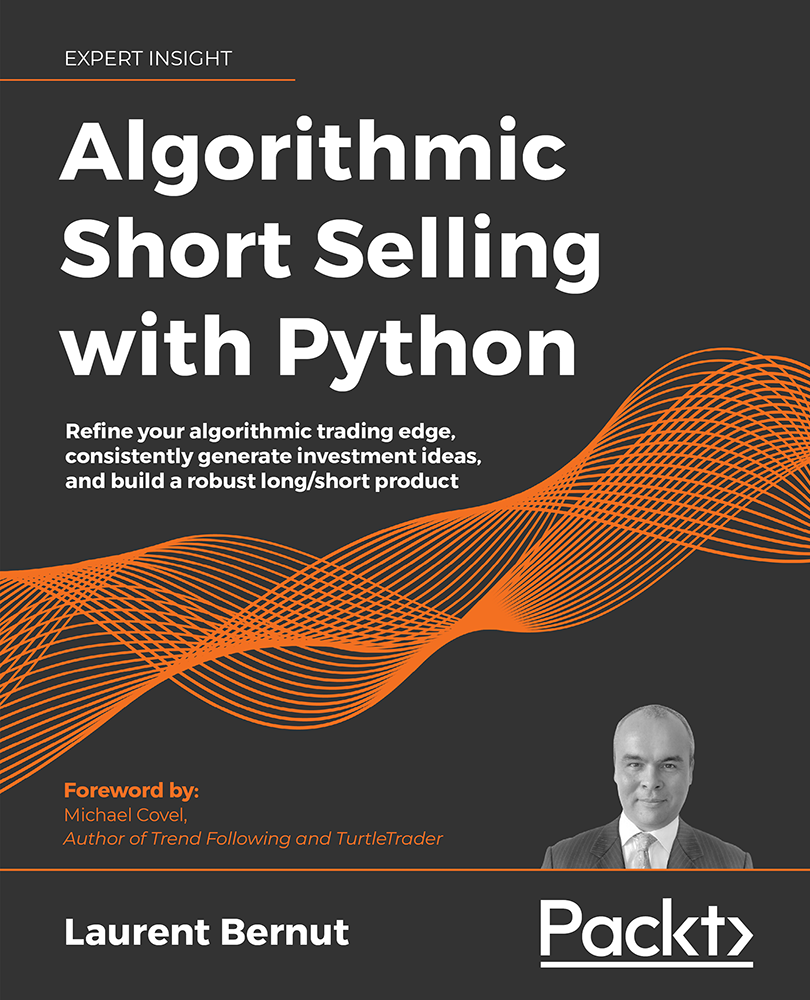

# Algorithmic-Short-Selling-with-Python
Algorithmic Short Selling with Python, Published by Packt

## Links

* [Amazon](https://www.amazon.com/Algorithmic-Short-Selling-Python-algorithmic-consistently-dp-1801815194/dp/1801815194/ref=mt_other?_encoding=UTF8&me=&qid=1632924207)
* [Packt Publishing](https://www.packtpub.com/product/algorithmic-short-selling-with-python/9781801815192)

## Key Features

Understand techniques such as trend following, mean reversion, position sizing, and risk management in a short-selling context.
Implement Python source code to explore and develop your own investment strategy.
Test your trading strategies to limit risk and increase profits.

## What you will learn

- Develop the mindset required to win the infinite, complex, random game called the stock market
- Demystify short selling in order to generate alpa in bull, bear, and sideways markets
- Generate ideas consistently on both sides of the portfolio
- Implement Python source code to engineer a statistically robust trading edge
- Develop superior risk management habits
- Build a long/short product that investors will find appealing

## Who This Book Is For
This is a book by a practitioner for practitioners. It is designed to benefit a wide range of people, including long/short market participants, quantitative participants, proprietary traders, commodity trading advisors, retail investors (pro retailers, students, and retail quants), and long-only investors.

At least 2 years of active trading experience, intermediate-level experience of the Python programming language, and basic mathematical literacy (basic statistics and algebra) are expected.

## Table of Contents
1. The Stock Market Game
1. 10 Classic Myths About Short-Selling
1. Take a Walk on the Wild Short-Side
1. Long/Short Methodologies: Absolute and Relative
1. Regime Definition
1. The Trading Edge is a Number, and Here is the Formula
1. Improve Your Trading Edge	
1. Position Sizing: Money is Made in the Money Management Module
1. Risk is a number
1. Refining the Investment Universe
1. The Long/Short Toolbox
1. Signals and Execution
1. Portfolio Management System
1. Appendix: Stock Screening 
